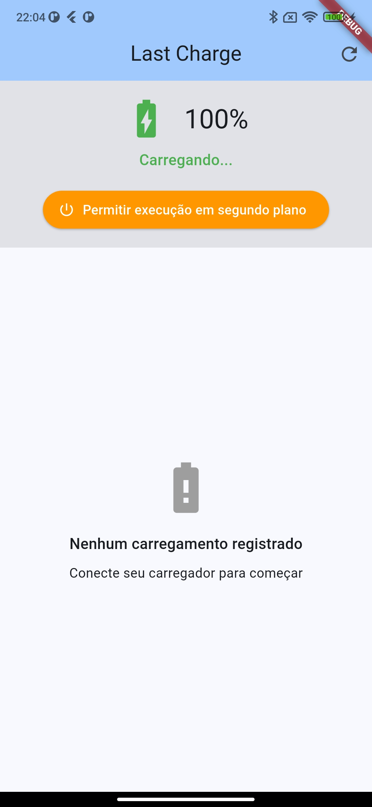
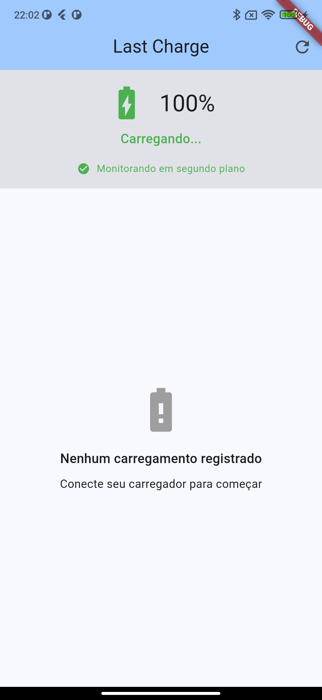
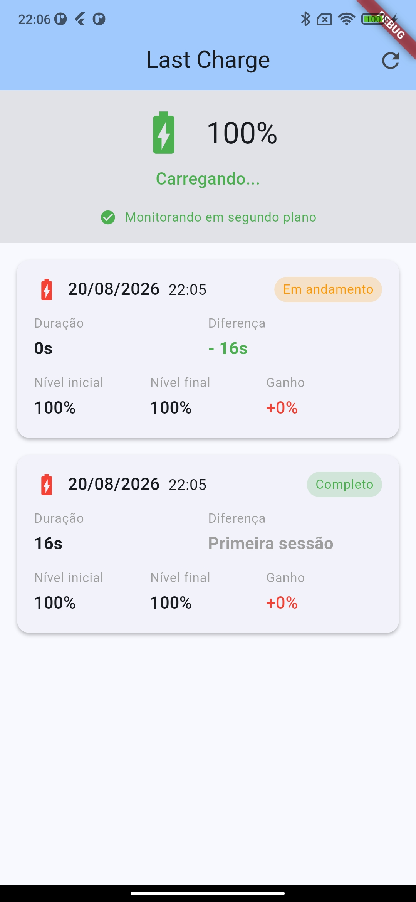

# Last charge

Aplicativo mobile desenvolvido como projeto de estudo.

## Problema

Dificuldade no monitoramento do carregamento do aparelho e vida útil da bateria.

## Solução

Desenvolvimento de um aplicativo que facilita o monitoramento do carregamento, trazendo informações úteis como duração de carga, diferença de tempo desde a última carga e outras informações a mais.

## Funcionalidades

- Monitoramento da carga da bateria

## Screenshots

<p align="center">
  
  
  
</p>

## Tecnologias

- Flutter
- Shared preferences

## Como executar

### Limpar os arquivos de builds

 ```sh
 flutter clean
 ```

### Baixar e resolver as dependências

```sh
flutter pub get
```

### Rodar o projeto no dispositivo

```sh
flutter run
```

### Requisitos

- flutter
- Android Studio
- Android SDK
